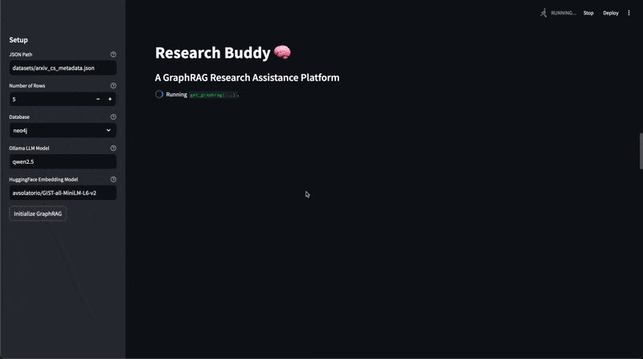
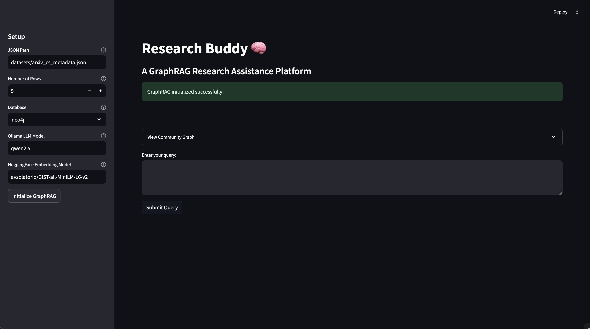
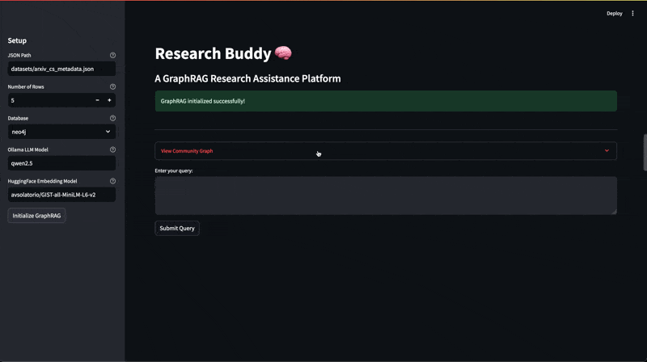
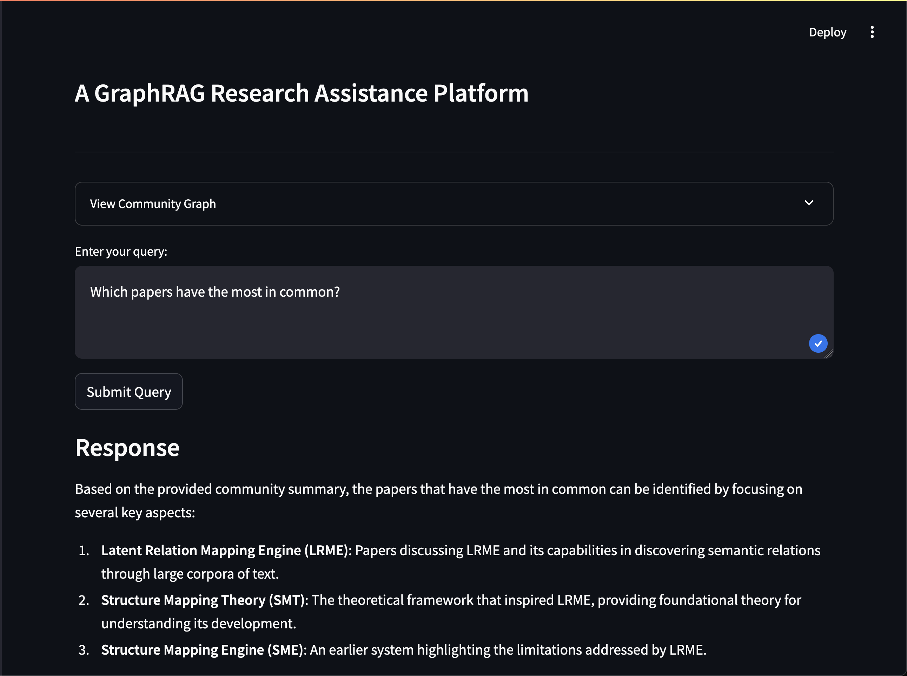
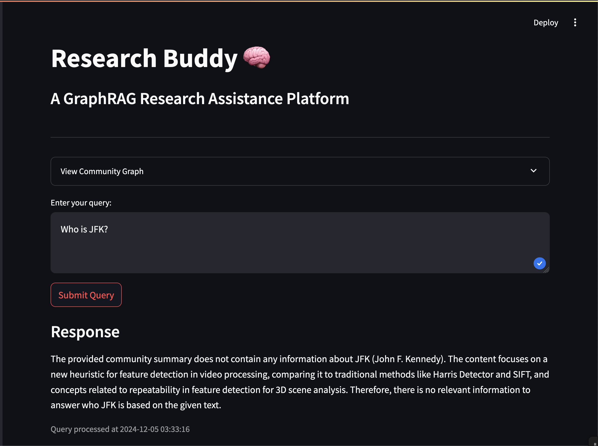
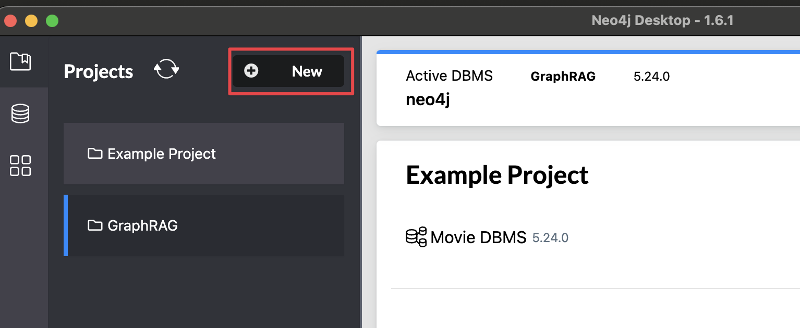
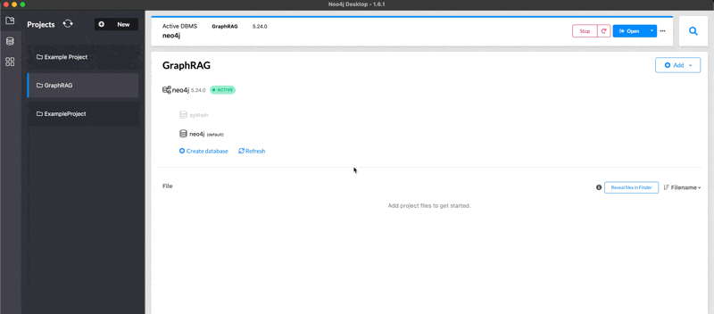
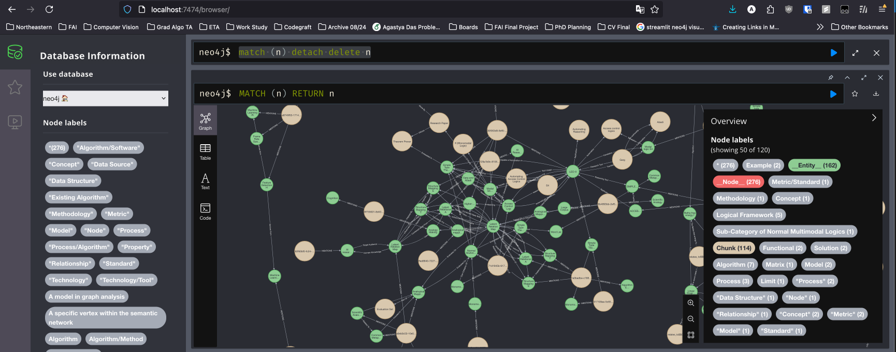

# Research Buddy
### 
A GraphRAG implementation for use with research papers. Built using LlamaIndex, Neo4j and a local LLM instance: Qwen2.5. 

### Contributors
Agastya Das, Yogesh Thakku Suresh, Luca-Alexandru Zamfira, Ayush Sharma.

Created for the final project for Graduate Foundations of AI (CS 5100) at Northeastern University.

### Dataset
https://www.kaggle.com/datasets/Cornell-University/arxiv/code

## Streamlit Demo 
### Initialization Page
> You might be looking at this for a bit -- ~15 minutes on my device. 
> 

### After Initialization

### Interactive community visualization

### Trying a Good Query (relevant to dataset)

### Trying a Bad Query (_not_ relevant to dataset)

## Setup instructions:

### Platform/Specs:
- This project was developed on, and has only been tested on macOS. Try other platforms at your own risk.
- An M1 Max with 32GB of unified memory was sufficient to run our local LLM: qwen2.5 (7b params default in Ollama).
- Other local models were more prone to hallucination, and caused some parts of the pipeline to break due to inability to adhere to directions. 

### Prerequisites:
- Install the desktop version of Ollama: https://ollama.com/download
- Install the desktop version of Neo4j: https://neo4j.com/download/

### Before you run:
- Create your conda environment (Python 3.11.10 was used for this project)
- Create a Project in Neo4j
- Install the APOC plugin to your DBMS. 
- Start your Neo4j DBMS (You'll need to set a password the first time). 
  - This should be accessible on your browser at `bolt://localhost:7687`.
  - I keep the default username "neo4j', and use "password" as the password. 
  - Each project can have multiple databases. I highly suggest using the default db, also called "neo4j"
- Run `pip install -r requirements.txt`
- In your terminal run: `ollama run qwen2.5`. You can change the model but we do not guarantee results with other models.
- While our methods for cleaning/creating `datasets/arxiv_cs_metadata.json` are included in `src/PullDataset.py`, we reccomend using the default, included, data set for best results/reproducibility. 

### How to run?
You have 2 options for running our project if you got through the setup successfully:
> WARNING: This will take some time. The Streamlit method is reccomended because it caches some of the setup processes (as long as you don't terminate the program), and is a nicer experience. The results are equivalent. 
1. CLI
	- run `python src/main.py`. 
	- If you used our suggested default values you won't need to specify any of these command line arguments:
    	- ` -j <dataset_json_path>, -n <nrows_from_dataset> -d <neo4j_db_name> -l <ollama_llm_model_name> -e <HuggingFace_embedding_model_name> `
2. Streamlit UI
   - run `streamlit run src/main_gui.py`

## Known issues:
- Terminal output is very verbose right now. We should replace this with logging.
- Most local LLMs that work on my M1 max, are still prone to hallucinations. 
  - These hallucinations affect the entity and relationship extraction process and can create poor results
  - This effect is greatly exacerbated when we've tried to load more than 5 papers
- While this doesn't affect the community-generation/querying process much, with every subsequent run, the neo4j graph db accumulates extra/duplicate nodes. The db should programmatically be cleared for every run. 
  - For now you can do this manually in the neo4j console, using the cypher query  `match (n) detach delete n`.
- Every run takes a while, pulling existing runs could be helpful.
- This could be a bug or feature, but rerunning the node/entity generation process multiple times creates far more detailed communities.
  